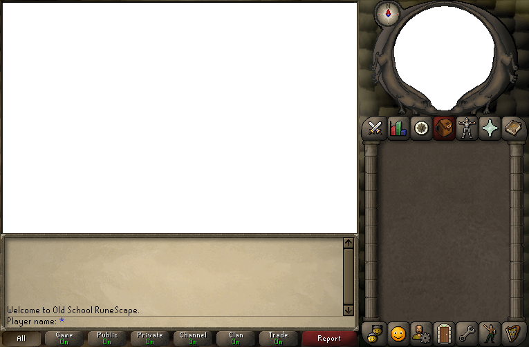
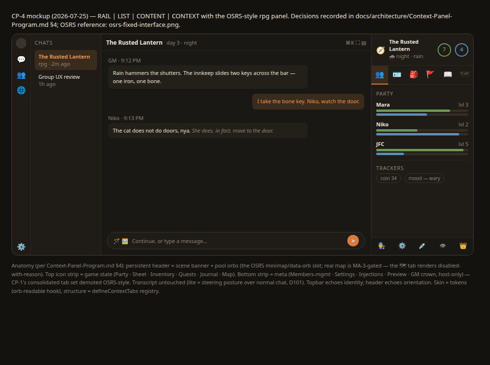

# Context-Panel Program — consolidation → width → trackers → the rpg takeover

> **Owner-initiated 2026-07-25** ("I think this is the section I want to work on next"). Working spec
> for the CONTEXT column; the board is `docs/retro-workboard.md`, the law is
> `core/UI-Architecture-and-Layout.md` §4.1–4.3 (D62/D66) + `core/client-architecture-lockdown.md`
> §6b (`defineContextTabs` / `ContextTabsPanel`). This doc ADDS content to the pane and re-groups its
> tabs; it never changes the shell geometry (CONTEXT stays a fixed-width, closable, never-navigation
> side panel — the four-region anatomy is invariant).

## 0. Why (receipts, 2026-07-25)

- **Underfill**: live widescreen check — the chat Members tab renders 3 rows (name · bare "50%" ·
  kebab) in a full-height column; the rest is void. The column does not earn its width.
- **Tab clip (side-eye P3)**: 5 tabs (Members · Overrides · Group · Preview · Injections) truncate at
  the default panel width with no overflow affordance; a 6th (Trackers) is already planned.
- **Duplication (§13 IA rule)**: the chat title + avatar cluster render in the topbar AND again in
  the panel header, 300px apart.
- **The owner's direction**: repurpose the column in rpg/rpg-lite as the OSRS right panel — reference
  image committed at `reports/design-refs/osrs-fixed-interface.png`; lite mode is a steering posture
  over NORMAL chat (D101 lite tier; the guided-generations audit §5 convergence — one ChatInjection
  steering channel — `reports/stickler/2026-07-25-guided-generations-parity-audit.md`).

## 1. CP-1 — Tab consolidation: Overrides + Group → one "Settings" tab (build FIRST)

Two of the five chat tabs are per-chat CONFIG wearing tab costumes; merge them.

- **End state (member)**: Members · Settings · Injections — (host adds) Preview. Post-Trackers the
  strip holds 5 max, never 6. The P3 clip dies structurally, not with a fade cue.
- **Shape**: one `Settings` context tab whose body is grouped sections on the settings-modal idiom
  (`Section` primitive, real `h3` headings — the house template): "Appearance overrides" (today's
  Overrides tab body) · "Group behavior" (today's Group tab body: output mode · speaker policy ·
  auto-mode · speaker tags · nudge). Host-only GROUPS omit for non-hosts (§8.1 permission-omit law —
  same gating the whole Group tab has today, moved down one level).
- **Mechanism**: the chat `defineContextTabs` contribution (fed from `features/chat` — see
  `chat-header.tsx:6` commentary + `chats-section.tsx`) contributes ONE tab where it contributed two;
  `room-overrides-tab.tsx` + the group tab body become sections of the new tab component. Registry
  change only — no bespoke `<Tabs>`, no new mechanism.
- **Ride-along polish (same lane)**: label the bare talkativeness value in Members ("Talks 50%" or an
  labeled meter — the bare "50%" fails the cold read); de-duplicate the panel header (the topbar owns
  identity; the panel header can drop the repeated title/avatar cluster once CP-2's header lands, or
  reduce to the tab strip immediately).
- **Roster-size gating (owner ruling, 2026-07-25)**: group controls do NOT render on a solo chat
  (1 character + 1 human = a normal chat) — APPLICABILITY gating, which OMITS (vs phase-gating's
  disable-with-reason; the third gating class). The Settings tab shows "Group behavior" only on a
  real group; one derivation of the roster-size predicate, reused from the existing >1-character
  gate.
- **The solo doorway (owner-shaped)**: the topbar members entry ("Members — N") renders on EVERY
  chat — on solo it opens a compact ROSTER menu (participant rows + "Add a character", riding the
  existing add-member flow) so solo→group stays reachable; group behavior unchanged. One home per
  concept — no second doorway in the ⋯ menu.
- **Done-criteria**: tab strip fits untruncated at the default width with 5 tabs (Trackers-ready);
  every former Overrides/Group control reachable + CT-covered under the new tab; cross-tab
  invalidation rows updated (the `getGroupConfig` BUS\_FILTERS lesson — any moved read keeps its
  invalidation coverage); member-vs-host CT matrix pins the group-level omit.

## 2. CP-2 — Width: give CONTEXT more room (owner amendment)

- **Current value** (GENERATED homes — never hand-edit; find the D71 seed and regenerate):
  `--dimension-panel: clamp(16rem, 22vw, 22rem)` (`packages/ui/src/styles/theme.css:79`,
  `packages/ui/src/tokens/index.ts:80`).
- **Amendment**: the owner wants "a bit more width". This changes the fixed VALUE, not the D62 rule —
  CONTEXT remains "a fixed `--dimension-panel` column, not a width recipient"; leftover width still
  feeds the centered CONTENT gutter. Proposed: `clamp(17rem, 24vw, 26rem)` (272→416px range vs
  today's 256→352) — at 1920 the column gains \~64px; at 1280 it gains \~16px. Tune on sight.
- **Coupled checks**: LIST + CONTEXT + rail at 1280 must still leave CONTENT ≥ its minimum before the
  auto-overlay breakpoint fires (the one app-shell `@media`) — re-derive the breakpoint if needed;
  `pnpm snap --wide` + `--viewport 1280x800` + `--mobile` before/after shots are the receipt. One
  token, one home — NO per-section width overrides (hardcoded-values law).

## 3. CP-3 — The Trackers tab (lite embryo; BUILD-GATED, design reserved)

The convergence design's member-facing steering surface: one additional chat context tab showing
tracker/pool/persistent-guide chips. **Gated on the steering-system build** (persistent guides = D59,
deferred until its wave; there is no tracker DATA in the retro tree today — rpg was purged). This doc
reserves the SLOT and the vocabulary; CP-1's 5-tab ceiling already budgets for it. When it ships it
must consume the ONE steering seam (ChatInjection + the guided audit §5 shapes), never a sideways
store.

## 4. CP-4 — The OSRS takeover (rpg rebuild scope; layout decisions RECORDED now)

When a chat is an rpg/rpg-lite game, the SAME pane (same registry, same geometry) presents:

```
[ header — persistent, non-tabbed: scene banner (location · time · weather · day) + POOL ORBS ]
[ top icon strip — game state: Party · Sheet · Inventory · Quests · Journal · Map ]
[ content pane — the active tab ]
[ bottom icon strip — meta: Members · Settings · Injections · Preview · GM(crown, host) ]
```

The committed visual references (both `git add -f`'d past the reports gitignore — cited records rule):





(`reports/design-refs/rpg-shell-mockup.html` is the editable source of the mockup PNG.)

Decisions (owner-reviewed via mockups, 2026-07-25):

- **Header replaces the minimap slot**: scene banner day one (scenes/weather existed in legacy lite);
  the REAL map is MA-3-gated — its strip slot renders DISABLED with the unlock named on hover
  (no-omissions law), exactly the OSRS locked-tab pattern.
- **Pool orbs = OSRS data orbs**: lite pool definitions render as glanceable header orbs.
- **Party (top strip) vs Members (bottom strip) are different lenses on the same people**: game state
  vs roster administration — the top/bottom split IS the OSRS inventory-above/settings-below logic.
  The bottom strip is exactly CP-1's consolidated tab set + the host-only GM console (legacy
  gm-drawer scope: scenes · widgets · session wrap).
- **The transcript is untouched**: all game chrome lives in the column; CONTENT stays ordinary chat
  (lite = a steering posture over normal turns — the D101 ruling).
- **Topbar echoes identity, header echoes orientation**: topbar "title · day 3 · night" vs header
  compass/weather/orbs — each occurrence has a distinct job (the CP-1 de-dup rule stays honored).
- **Skin is tokens, structure is registry**: the RS look (stone/parchment) is a token-level visual
  treatment (the parked `orb-readable` parchment hook) — themes stay palettes; the STRUCTURE is
  artifact-driven registry content, present under every theme.

## 5. Sequencing + laws

**CP-1 → CP-2 land together as one lane** (can run parallel to the guided Phase-1 lanes — disjoint
files). **CP-3** rides the steering/persistent-guides wave. **CP-4** is the rpg rebuild's client
centerpiece; this doc + the committed reference image + the mockups are its inherited design intent.

Binding laws: `defineContextTabs` registry only (lockdown §6b) · CONTEXT never navigation, closable,
fixed width (D62 §4.2) · §8.1 permission-OMIT for host-only groups; phase-gating renders
disabled-with-reason, never omitted (\[\[no-separate-reduced-modes]]) · one home per concept (the
Overrides/Group split was an implementation seam, not a user concept) · tokens only; generated token
homes regenerate via the D71 pipeline.

## 6. Open questions (owner)

1. CP-2's exact clamp values — take the proposed `clamp(17rem, 24vw, 26rem)` or tune on sight?
2. The merged tab's name: "Settings" vs "Chat settings" (strip real-estate favors "Settings").
3. CP-1 ride-along: drop the panel-header title/avatar cluster now, or hold for CP-4's scene header?
