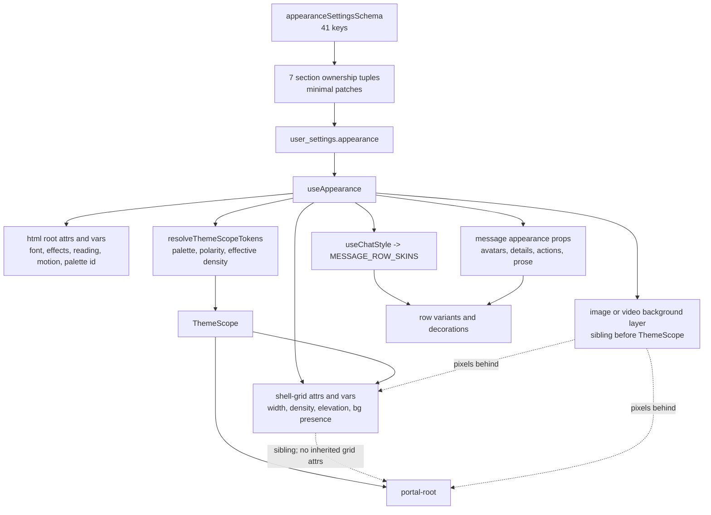
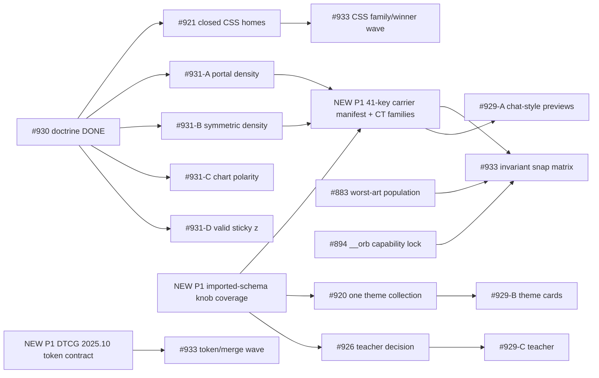

# Visual / Client issue corpus and Appearance prevention audit

Committed-source baseline: `0445b0e517d860f4f157dd7ab4e66abac2888ea4` (2026-08-31). This is a
pre-implementation audit. Concurrent uncommitted work on the shared tree, including the in-progress #921
gate replacement and a proposed token-contract document, is excluded from source-truth claims below. No
Project field, issue, product/tooling source, commit, or remote was mutated by this lane.

## Current-state reconciliation (2026-08-31)

This report preserves the pre-implementation evidence below; it is not a live status board. Every
"Current prevention" label and issue count below this reconciliation is current at baseline `0445b0e517`,
not at HEAD. The current replacements are:

- **#921:** `9b0e6debb` replaced the feature-only proxy with the exact-six `sanctioned-css-homes` gate;
  cold review found dot-path and wrong-file-kind bypasses; `fee25f89b` closed both, deleted the exposed
  `.ds-preview-*` seventh home, and passed independent cold confirmation.
- **#934:** `19ed6321f` restored all 41 imported Appearance leaves without moving the domain-owned schema;
  the real tree now reports `contracts=1 sources=2 leaves=166 appearanceLeaves=41`, with imported red/green
  controls and independent cold confirmation. #935 subsequently closed the schema-derived 41-key carrier
  program; rendered composition remains owned by the named acceptance and #953 matrix cells rather than by
  name-liveness alone.
- **#936:** the structured DTCG contract/emitter landed, then frontier review forced explicit output
  placement, honest fs-vs-Git proof, exact CSS-target identity, and exact Light/Mocha seed membership before
  closure. Final receipt: 178 targets, 272 scanned entries, 44/44 adversarial checks, byte-identical artifacts.
- **#937:** root portal density and every current card-sourced nested ThemeScope bypass closed after two cold
  refutations; 1,235-file census, 42/42 unit/security, and 3/3 rendered receipts.
- **#940:** modal stacking uses existing `z.raised`; the z gate is 7/7 vault-parity checked and covers exported
  class recipes after cold refutation; the real overlap/hit-test CT passed.
- **#938/#939 and the grouped CSS prevention train:** comfortable/compact density is symmetric; seed and
  accepted custom-theme chart ramps are contrast-safe; #949–#952, #954–#957, #959, #961, and #965 graduated
  their merge, cascade, ownership, polarity, topology, and bounded-provenance barriers. #921's exact six-home
  gate remains the F9 closure; its historical path-short defect below is evidence, not current status.
- **#972/#975:** static `tv` provenance proved 413 observations in each ownership gate, leaving 508 genuinely
  runtime-assembled observations and zero `cva` population. Live cascade tracing now skips legitimate null
  SDK classifications before its denominator, retains mixed classified rows, refuses ordinary zero classified
  populations, recovers Vite provenance from `data-vite-dev-id`, and carries a 479-resource / 9,853,687-byte
  same-revision closure. Six live properties returned structured nonzero traces with zero unexpected requests.
- **#976/#977:** design-audit now accounts for all 381 settled subjects exactly and proves requested/resolved/
  actual theme polarity; motion-audit uses one canonical full-device contract and proves the exact iPhone
  runtime environment. A same-viewport counterfeit exits 2. The 100ms live mobile run classified the accepted
  \#824 collapsible height animation; it did not claim physical-device jank or a #977 defect.
- **#974 scope rulings:** the wallpaper avatar hairline stays grid-only because a portalled Dialog owns its
  own polarity-aware popup backing; retain one rendered dialog-avatar-over-art pin. `data-has-bg-image` has
  one production writer on `.shell-grid`; bare descendant, grid-qualified, and portal-sibling selectors encode
  different reach and must not be normalized. #852 proves the initial late-style drain in both directions;
  \#953 must await `motionFlaggersSettled()` and reset checkpoint evidence, while post-settlement style
  injection still needs an explicit per-drain marker.
- **Instrument prerequisites:** #881, #882, and #894 closed the shared fail-loud verdict denominator, derived
  design-rule liveness, and self-describing bridge/ring contracts. They make #953's future matrix inputs
  inspectable; they do not make the matrix or mandatory scenario floors exist.

The historical findings and 215-issue corpus below remain unchanged as evidence from their declared base.
Current implementation status is governed by this reconciliation and the active architecture law, never by
the original recommendation tense.

## Findings

### P1 — `knob-wire-coverage` lost all 41 Appearance leaves when #448 moved the schema

`tooling/src/verify/gates/knob-wire-coverage.ts:69,360-370,394-400,514-540,585-592` — Arm C obtains
settings leaves by walking `z.object({...})` calls in exactly
`packages/contracts/src/settings/index.ts`; `packages/contracts/src/settings/index.ts:20-36,866`
now imports and inserts `appearanceSettingsSchema`, while the 41 actual leaves live in
`packages/contracts/src/settings/appearance.ts:135-221`. Consequently none of the 41 Appearance keys is
an Arm-C member. A new Appearance field can validate, persist, and have an editor while no runtime carrier
reads it, and the gate remains green.

Concrete failure scenario: add `appearance.dialogBackdropStrength` to the imported schema and to one
config section, but never consume it. `assertSettingsKeyPartition` accepts its exactly-one editor; Arm C
never sees the imported leaf; the user gets a working save control that changes no pixels. That is the
dead-switch class the gate claims to prevent.

Evidence produced this session:

- `ast-grep run -p 'z.object($A)' -l ts packages/contracts/src/settings/index.ts --inspect summary`
  scanned one file and showed `appearance: appearanceSettingsSchema`, not the 41 properties.
- The same non-vacuity-checked sweep on `packages/contracts/src/settings/appearance.ts` scanned one file
  and found the actual `z.object` with all 41 properties.
- Literal/source read proved `SETTINGS_CONTRACTS` is the path regex at line 69 and
  `settingsLeaves(settings, ...)` never follows the imported symbol.
- The permanent Arm-C positive at lines 585-592 plants an inline `z.object` in `settings/index.ts`; it
  does not plant the refactor shape that caused the blind spot.
- \#448's closure evidence proves the move was intentional and green for boot size/object identity, but
  names no coupled `knob-wire-coverage` receipt.

Current prevention: **ABSENT for Appearance Arm C**. The editor partition is ENFORCED; consumer liveness
is not. This is also a premature closure residue from #448: its stated outcome was achieved, but the
cross-gate effect of moving the member source was not re-proved.

Earliest cheap tier: the existing structure gate. Make leaf discovery symbol/import-graph based, or
explicitly add `appearanceSettingsSchema` as a member source with a rename tripwire and set-equality to the
schema. Plant the exact positive: move a settings sub-schema into an imported module, add one unread leaf,
and require Arm C to red. This belongs in a new P1 Tooling work item, before #920/#926/#929 and before
\#933's matrix work. Even repaired, Arm C proves only a name-shaped read somewhere; it cannot prove the
correct consumer, both arms, DOM reach, interaction behavior, geometry, or contrast.

### P1 — the claimed DTCG source is not valid against the current 2025.10 typed-value contract

`packages/ui/src/tokens/tokens.json:1-2,298-425,699-744` and
`packages/ui/tokens.build.ts:15-22,77-92` — the file has no 2025.10 `$schema`, and 140 explicit typed values
use the old CSS-string shape: 60 colors, 67 dimensions, 8 durations, and 5 shadows. The count deliberately
excludes 15 color alias strings so aliases cannot inflate the finding. The current
[DTCG Format Module 2025.10](https://www.designtokens.org/TR/2025.10/format/) requires structured typed
values: dimensions and durations are `{value, unit}` objects, colors use the Color Module structure, and
shadows are structured composites. `renderValue()` currently special-cases arrays and otherwise calls
`String(value)`, so canonical objects would emit `[object Object]`; Style Dictionary accepting the legacy
input is compatibility, not conformance.

Concrete failure scenario: #933 adds a “DTCG coverage” check that validates only that every token has
`$type/$value` or that Style Dictionary can export it. The program closes green while the declared source
continues using a superseded syntax that another current DTCG consumer correctly rejects. Later migration
requires simultaneous source, reference, extension, seed-value-set, generator, typed-map, and Tailwind
emission changes under launch pressure.

Evidence produced this session:

- A complete recursive inventory found 178 tokens:
  `color:string=75`, `dimension:string=67`, `duration:string=8`, `shadow:string=5`,
  `cubicBezier:array=1`, `number:number=14`, `fontFamily:string=2`, `string:string=6`.
- A second pass removed `{path.reference}` color aliases and counted 140 explicit legacy typed strings.
- `rg -n '"\$schema"' packages/ui/src/tokens/tokens.json packages/ui/src/tokens/themes/*.json` returned no
  schema declaration.
- The lockfile is current on the Tailwind side (`tailwindcss@4.3.3`, `tailwind-merge@3.6.0`,
  `tailwind-variants@3.2.2`, Style Dictionary `5.5.0`), so preserving the input strings is not justified as
  a Tailwind-v3 compatibility boundary.

Current prevention: **ABSENT**. The freshness test proves the generated artifacts equal this generator;
it does not prove the source is a valid current DTCG document. #933 says “audit DTCG coverage by value
family,” but does not explicitly require normative 2025.10 schema validation or migration. Under the
owner's no-legacy ruling, that ambiguity is a program defect.

Earliest cheap tier: schema validation before generation. Add the normative 2025.10 schema/version at the
source door; make the renderer exhaustively handle each used current type; plant one legacy string for a
typed dimension/duration/color/shadow and one malformed structured value. External compatibility, if any,
must be an explicit adapter at the export boundary, never a reason to keep the canonical vault legacy.
Split this into a P1 UI/Tooling prerequisite for #933; migrate source + generator + generated artifacts in
isolated value-family steps with rendered receipts where output spelling can change.

### P1 — no current mechanism proves the seven-group / 41-key Appearance carrier graph

The current contract is exactly seven ownership tuples and 41 keys:

- sizing 5
- effects 5
- background 9
- reading 6
- avatars 5
- message style 3
- message details/actions 8

`assertSettingsKeyPartition` proves those keys have exactly one editor claim and honest leaf/default
bindings. The now-blind Arm C was only name-liveness even before #448. The remaining CTs are hand-picked
behavior pins. There is no schema-derived manifest stating which key must reach which carrier, which arms
must differ, which descendants/portals must inherit it, or which high-risk pair/triple must be composed.

Concrete failure scenario: the contract and editor add a valid key, an unrelated string occurrence makes
a repaired name-based Arm C green, and no generated test cell exercises its portal/mobile/light/background
interaction. The first honest detector is a future snap or a side-eye report. #231, #626, #653, #674,
\#681, #697, #877, #929, and #931 are all variations of this path: the value existed, a local proof passed,
but the relevant reach, opposite arm, composite, or instrument denominator was outside it.

Current prevention: **KNOWN-UNENFORCED** as a whole. Individual axes range from ENFORCED to
RENDERED/SIDE-EYE-ONLY; the table below names the exact boundary. #933 recognizes an appearance matrix,
but its one issue combines diagnostic infrastructure, semantic CSS ownership, merge namespaces, token
auditing, and the interaction matrix. A single acceptance checkbox cannot preserve the 41-key proof.

Earliest cheap tier: before snap, a generated contract/carrier manifest plus CT families:

1. schema-key ↔ owner-tuple ↔ declared carrier set-equality;
2. per boolean/enum axis, both-arm computed or DOM behavior at the narrowest real composition;
3. pairwise interaction cells derived from the manifest, plus explicit portal/background/mobile/message
   triples;
4. snap only for facts that require browser composition, real layout, pixels, or cross-surface judgment.

Plant one positive per tier: a missing carrier declaration; a carrier that reads the wrong key; equal
computed results for two required-distinct arms; an unreachable portalled arm; and a known bad pixel cell.
Create a dedicated P1 Client+Tooling work item and make it a dependency of the #933 snap matrix and the
config implementation train.

### P1 — #931 remains three fully live defects plus one live product defect with stale gate text

The committed source confirms the product side of all four #931 items:

1. `packages/client/src/features/app-shell/surfaces/app-shell.tsx:235-251,382-385` stamps density on
   `.shell-grid`; `portal-root` is its sibling inside `ThemeScope`. Appearance density therefore does not
   reach portal descendants.
2. `packages/client/src/features/app-shell/surfaces/shell.css:74-85` has only a compact arm. A nested
   `data-density="comfortable"` below a compact ancestor inherits the compact aliases, so the live preview
   cannot switch compact → comfortable.
3. `packages/ui/src/styles/theme.css:47-57` has a fixed chart ramp next to the polarity-aware track ramp;
   the census measured Light cells below 3:1.
4. `packages/client/src/features/app-shell/components/modal-host.tsx:73` still names
   `z-(--z-sticky)` while `packages/ui/src/tokens/tokens.json:699-710` defines seven z tokens and no
   `sticky`; the computed declaration drops to `auto`.

The stale part is #931's claim that `no-raw-z-index` still advises `z-sticky`/`z-dropdown`.
`tooling/src/verify/gates/no-raw-z-index.ts:47-48` at the committed baseline already lists only the seven
real tokens and explicitly warns that names outside them drop. #930 repaired that half. Do not implement
the obsolete gate-message fix again.

Current prevention: #1 **ABSENT**, #2 **ABSENT**, #3 **KNOWN-UNENFORCED**, #4
**KNOWN-UNENFORCED**. Current first detectors were snap/census pixels for #1/#3/#4 and the live config
preview for #2. Split #931 into four independently landable issues; fix portal reach and the symmetric
density mechanism first because #929's config preview and every overlay matrix depend on them. Each split
keeps #931 as the parent evidence index rather than closing four behaviors on one receipt.

### P2 — #929's chat-style preview is structurally incapable of depicting five of eight skins

`packages/client/src/features/chat/components/appearance-chat-style-cards.tsx:1-11,30-40` says the cards
derive from `MESSAGE_ROW_SKINS`, but deliberately renders only `outer()` and `inner()` around two neutral
bars. It omits `bubbleDecoration`, `avatarTreatment`, `bubbleLayout`, `headerPlacement`, `columnStyle`,
real role color, and the message/header anatomy. Those omitted fields are the defining behavior of Echo,
Whisper, Hush, Ripple, and Tide in
`packages/client/src/features/chat/lib/message-row-variants.ts:296-377`.

The CT at `tests/client/features/chat/components/appearance-message-style-section.ct.tsx:63-92` proves
eight cards, glosses, pressed state, and that Bubble differs from Document. It does not compare every mode,
does not require each preview to depict its defining mechanic, and specifically permits Bubble and Echo to
be identical. This directly confirms #929 A1-A6; the source comment calling the omission deliberate is
stale design reasoning, not evidence that the preview is honest.

Current prevention: **RENDERED/SIDE-EYE-ONLY**. Earliest cheap tier is a preview-model exhaustiveness test:
every `ThemeChatStyle` must declare a preview anatomy/identity marker derived from the real skin data, and
specified distinct pairs must not be structurally or pixel-identical. Snap is still necessary for card-row
rhythm, caption/baseline alignment, actual color, and three-theme/pointer composition. Split #929 A into
its own Client item; do not couple it to theme collection (#920) or teacher (#926).

## The actual Appearance graph



Important carrier facts:

- `ThemeScope` and `.shell-grid` are not the same node.
- `portal-root` is a sibling of `.shell-grid`, not its descendant.
- the image/video background layer is outside and before `ThemeScope`.
- custom theme density can override Appearance density in `resolveThemeScopeTokens`; seed/absent themes
  yield to Appearance density.
- message style is split: `chatStyle` has its own hook/table, while quote coloring and auto-fix ride the
  message-prop hook.

## All seven Appearance ownership groups and their high-risk interactions

| Group | Exact keys | Current carriers / consumers | High-risk interactions and issue evidence | Current prevention and first detector |
| - | - | - | - | - |
| Sizing (5) | `chatWidthPct`, `fontScale`, `density`, `elevation`, `reducedMotion` | `--width-shell-content` on grid; `--font-scale` + motion attr on `<html>`; effective density and elevation on grid; boot hint stores motion/scale/density but pre-stamps only motion/scale | density × custom-theme density; compact × comfortable; grid × portal; density/elevation × dock/overlay/mobile; font scale × shell breakpoints/CLS; motion × portals/boot/background video. #122, #129, #146, #231, #282, #315, #465, #654, #663, #680, #815, #821, #823, #835, #837, #877, #918, #929, #931 | Width/font/motion have focused computed CTs; boot no-clobber is rendered. Density portal/both-arm are ABSENT; geometry is first caught by AppShell CT where a specific cell exists, otherwise snap/side-eye. |
| Effects (5) | `blurSurfaces`, `blurStrength`, `shadowEffects`, `surfaceTexture`, `enableThemeColorization` | `<html>` attrs/var; client/UI globals; shell cascade; texture reaches portal through root | blur × background × polarity; glass × elevation; texture × portal; colorization × ThemeScope tokens; reduced motion × texture/animation. #204, #217, #232, #237, #243, #487, #626, #637, #674, #681, #682, #690, #692, #693, #697, #918, #931 | Root stamping ENFORCED; selected glass/elevation and texture portal CTs rendered; population coverage remains REPORTED-BUT-UNREAD or RENDERED/SIDE-EYE-ONLY. Snap pixels required for compositing. |
| Background (9) | `backgroundImageKind`, `backgroundSeededId`, `backgroundAssetId`, `backgroundAssetHash`, `backgroundAssetMime`, `backgroundLibrary`, `backgroundFit`, `backgroundDim`, `backgroundBlur` | source resolves to image or video fixed layer; chat/carried source can replace viewer source; fit/dim/blur remain viewer treatment; grid gets `data-has-bg-image` | image/video × reduced motion; art × blur/elevation/plate/polarity; carried chat background × section changes; asset/library atomicity; mobile crop. #170, #204, #217, #225, #231, #237, #282, #320, #321, #448, #487, #549, #622, #626, #637, #650, #654, #674, #681, #883, #918, #929, #931 | Resolver and layer CTs ENFORCE source/type branches; visual crop/composite/contrast is RENDERED/SIDE-EYE-ONLY. #883 is the needed DOM-derived worst-art population guard. |
| Reading (6) | `readingLineHeight`, `readingLetterSpacing`, `readingParagraphSpacing`, `readingNameScale`, `readingBodyScale`, `justifyBodyText` | `<html>` vars/attr; globals consume them on message bubble/attribution/prose | reading scale × global font scale; spacing × skins/trains; justify × narrow/mobile; prose ink × wallpaper/ThemeScope polarity. #167, #204, #217, #221, #225, #229, #236, #237, #241, #243, #282, #465, #487, #626, #674, #681, #883 | `use-appearance-root-effects.ct` gives strong computed consumption for all six in one non-default arm. Opposite arms, skins, narrow geometry, and art are not population-enforced; snap remains necessary. |
| Avatars (5) | `showInChatAvatars`, `avatarSize`, `avatarShape`, `avatarAspect`, `avatarRing` | one message-list read; props to row; chip, inline/gutter, Ripple portrait, Echo/Whisper decoration | master off × four dependents; off × immersive art; size/aspect × mobile gutter/row width; ring × polarity; group attribution. #98, #146, #167, #170, #206, #212, #231, #282, #312, #465, #654, #837, #929 | Specific row/unit pins ENFORCE several immersive/off arms. No generated five-key × eight-skin × role × viewport matrix; first broad detector is message-row CT when named, otherwise side-eye. |
| Message style (3) | `chatStyle`, `colorQuotedSpeech`, `autoFixMarkdown` | `chatStyle` via `useChatStyle` and exhaustive `MESSAGE_ROW_SKINS`; quote/repair via `useMessageAppearance` into settled and ghost content | 8 skins × roles × avatar/art × reading/background; quote color × carried theme; auto-fix × settled/streaming; preview honesty. #98, #167, #212, #229, #231, #282, #288, #465, #626, #674, #681, #837, #929 | Skin vocabulary/table is ENFORCED and many mechanics have focused pins. Picker fidelity is RENDERED/SIDE-EYE-ONLY; the present CT's Bubble-vs-Document inequality is too weak. |
| Message details/actions (8) | `showTimestamps`, `showMessageId`, `showModelIcon`, `showTokenCount`, `showGenerationTimer`, `showGenerationCost`, `showLLMReasoningIcon`, `messageActions` | one message-list read; metadata visibility, reasoning icon, and hover/expanded action props | metadata × name/time backing; hover × coarse pointer/keyboard; actions × short bubbles/containment; host-only items × menu; reasoning × live/settled. #98, #107, #112, #167, #199, #206, #221, #228, #229, #288, #312, #364, #371, #372, #420, #424, #441, #490, #655, #662, #665, #670, #674, #681, #684, #786, #797, #807, #822, #840, #842, #848, #849, #850, #869, #871, #874, #878, #929 | Individual props/roles/containment are focused CTs; no schema-derived eight-key population or pointer/portal/theme composition. Current first detector is row CT for known cells and snap/side-eye for unseen combinations. |

## What the current gates and CTs actually prove

| Mechanism | What it proves | What it does **not** prove | Classification for Appearance |
| - | - | - | - |
| `assertSettingsKeyPartition` (`config-section-partition.ts:70-120,196-212`; real-door test lines 233-288) | Once any namespace is decomposed, every default key is claimed/cited; no exact or nested overlap; leaf bindings belong to the claim and resolve a default. The seven real Appearance contributions are in the door. | No consumer read, correct key, both-arm behavior, carrier reach, DOM geometry, contrast, or preview honesty. | **ENFORCED** for write ownership only. |
| `knob-wire-coverage` Arm C | For inline schemas in `settings/index.ts`, every distinctive leaf name occurs in a read-shaped node somewhere in client/server/UI. | All 41 imported Appearance leaves after #448; correct receiver/consumer; effects; arms; reach; pixels. | **ABSENT** for Appearance; weak name-liveness elsewhere. |
| `density-tier` gate | Surface-tier assignment/radius/nesting/voice shape and registered tier-mapped slots. | User Appearance density, portal reach, comfortable reset, or actual shell selector. `UI-Density-Law` explicitly makes surface tier orthogonal to user density. | **ENFORCED**, but for a different axis. |
| `density-tier.suite.ct` D9 (`:141-159`) | An ancestor custom-property rebinding changes a tier consumer. | It says the shell stylesheet is not loaded; it does not exercise `[data-density]`, compact and comfortable, or portal sibling reach. | **KNOWN-UNENFORCED** for the actual setting. |
| Boot-hint CT (`appearance-boot-hint.ct.tsx:28-73`) | Persisted motion/scale/theme replay, fresh/corrupt/default behavior, and server-wins memory. Density is retained in the hint output. | Density pre-stamp (source explicitly does not stamp it), final compact/comfortable values, portals, or interaction. | **ENFORCED** for boot handoff; not render reach. |
| Root-effects CT (`use-appearance-root-effects.ct.tsx:1-126`) | All six reading variables reach computed message/attribution CSS in one non-default fixture; root hook stamping is real. | Most effect both-arms, every target population, cross-theme/art interactions, or cleanup under real navigation. | **ENFORCED** for reading consumption; partial for effects. |
| ThemeScope CT (`theme-scope.ct.tsx:92-99,167-255,373-390`) | Density becomes an attribute; palette vars clamp/inherit; open popover/select/menu/dialog inherit a themed portal root; selected contrast/elevation pairs render. | Appearance density on the shell ThemeScope, spacing changes, comfortable reset, grid-vs-portal parity, whole palette/slot population. | Theme/palette **ENFORCED** in named cells; density only read/stamp. |
| AppShell CT (`app-shell.ct.tsx:923-939,3035-3185,3692-3720,3757-3865,4545-4597,4723-4839`) | Modal theme inheritance; selected glass/elevation/background precedence; width/font computed effects; reduced-motion document reach; boot no-clobber; specific pixel contrasts. | A generated 41-key matrix; density parity/both arms; all portals/surfaces; pairwise coverage. Its #231 density receipt asserts only the remembered compact attribute. | Strong focused **RENDERED** pins, no population closure. |
| Appearance section CTs | Persisted defaults render, controls change, debounce sends a key-minimal patch, selected responsive row geometries. | That a saved value changes its real consumer or that previews depict the output. | **ENFORCED** write path; behavior generally unproved. |
| Message-row unit/CT | Exhaustive 8-skin table and many role/avatar/metadata/containment mechanics. | Cross-product with all settings, themes, art, pointer, viewport; picker fidelity. | Focused **ENFORCED/RENDERED**, matrix absent. |
| `deadcss` / `emptycss` / live `[css]` | Parse/reach for the scenarios driven. | Merge winner, cascade winner, un-driven surfaces; reports are not a blocking floor. | **REPORTED-BUT-UNREAD**. |
| snap + side-eye | Real browser composition, pixels, geometry, contrast, focus/keyboard, visual hierarchy and honesty for the scenario actually driven. | Un-driven combinations; a clean result without declared denominator. | Necessary final tier; currently often the **first** detector. |

## Mechanism-level recurring-defect map

The issue receipts below are not a title taxonomy. They are grouped by the mechanism that let the defect
survive. Issues may appear in more than one family because the interaction is the defect.

| Recurring family | Issue receipts | Current truth / alleged fix liveness | Prevention class | Why it recurs | Earliest cheap tier before snap | Where snap is still necessary | Planted positive and owner/dependency |
| - | - | - | - | - | - | - | - |
| Editor/contract/read carrier splits | #98, #170, #231, #282, #320, #321, #448, #465, #487, #549, #622, #626, #637, #650, #654, #837, #866, #918, #929, #931, #933 | Partition/minimal patches live. #448 boot split lives but blinded Arm C. | **ENFORCED** writes; **ABSENT** 41-key reads | Separate contract, editor, cache, carrier, CSS, and visual tiers can each be locally green. | Imported-schema-aware Arm C + schema-derived carrier manifest. | Live-save effect, visual result, async/boot transition. | Imported sub-schema dead leaf; wrong-key consumer. Tooling + Client, new P1 before config. |
| Selector/cascade/merge winner | #114, #135, #137, #138, #146, #169, #189, #211, #218, #225, #249, #253, #444, #464, #466, #508, #624, #653, #660, #678, #797, #808, #816, #825, #851, #877, #891, #918, #919, #921, #930, #931, #933 | #930 doctrine live; #921 committed baseline still path-short; #933 diagnostics unbuilt. | **KNOWN-UNENFORCED** + **REPORTED-BUT-UNREAD** | Valid classes/declarations still need a winner; path permission is not semantic family ownership. | Closed CSS home gate; merge namespace set-equality; computed winner CT for named axes. | Cross-sheet cascade, container/media state, real element geometry. | Mis-homed CSS in UI and Client; loser→winner class pair. #921 then #933. |
| Reach/portal/root-carrier mismatch | #135, #137, #138, #188, #211, #231, #282, #315, #444, #465, #653, #654, #678, #797, #808, #816, #825, #877, #918, #931 | Theme and reduced-motion portal fixes live; density remains grid-only. | Theme/motion **ENFORCED**; density **ABSENT** | An attribute is stamped where one consumer lives, then a sibling/portal/boot surface is added outside it. | Carrier manifest + CT asserting common-ancestor parity. | Open overlays/toasts and composed focus/geometry. | Compact grid + dialog sibling; both density arms. #931 F1 then #933 matrix. |
| One-way/asymmetric state | #98, #114, #146, #231, #282, #315, #465, #653, #654, #797, #837, #866, #918, #929, #931 | Many individual off/re-enable pins live; density comfortable reset absent. | **KNOWN-UNENFORCED** | Tests prove the changed arm, not the return arm; inherited vars retain the ancestor value. | For every boolean/enum, generated required-distinct both-arm CT. | Transition, animation, layout settle, visual meaning. | Compact→comfortable and comfortable→compact in same mount. #931 F2 prerequisite. |
| Polarity / token pairing / over-art composition | #97, #106, #167, #204, #217, #221, #225, #229, #232, #236, #237, #241, #243, #282, #487, #626, #674, #681, #682, #690, #692, #693, #697, #874, #883, #918, #931 | #626 gate has zero miss on its exact plate-rule class. Post-#626 recurrence was no-backing or token-pairing, not a gate miss. #883 remains open. | Plate rule **ENFORCED**; populations **RENDERED/SIDE-EYE-ONLY** | `getComputedStyle` cannot see art composition; hand-listed pairs and local surfaces omit new families. | DOM-derived pair/host population with non-zero denominator; static polarity-arm set-equality. | Framebuffer pixels on worst legal art, both polarities, real backdrop. | Unbacked text node and new categorical ramp pair. #883 before #933 contrast cells. |
| Geometry, responsive containment, CLS | #92, #122, #129, #130, #147, #149, #151, #168, #176, #177, #213, #226, #242, #280, #315, #334, #354, #355, #364, #375, #380, #381, #383, #444, #453, #465, #476, #489, #490, #491, #654, #663, #680, #685, #776, #810, #815, #819, #821, #823, #824, #830, #835, #836, #837, #842, #845, #846, #847, #850, #852, #853, #857, #858, #868, #875, #878, #895, #896, #908, #929, #931 | Many local CTs live; no generated appearance × dock × viewport matrix. | Focused **RENDERED**; population **ABSENT** | Container, viewport, dock state, font scale, and content length change the same available measure. | Relation-based CTs on min/max/ordering/containment; pairwise manifest. | Actual breakpoint composition, scrolling, CLS, long content. | Font 1.25 × both panels × mobile; short/long rows. Client + #933 matrix. |
| Message chrome/actions/hover | #98, #107, #112, #167, #199, #206, #212, #221, #228, #229, #288, #312, #364, #371, #372, #420, #424, #441, #490, #655, #662, #665, #670, #674, #681, #684, #786, #797, #807, #822, #840, #842, #848, #849, #850, #869, #871, #874, #878, #929 | Eight skins exhaustive; several hover/coarse/containment cells pinned; picker depiction remains false. | Focused **ENFORCED/RENDERED**, population **ABSENT** | One row composes skin, role, attribution, art, metadata, actions, pointer, width, and virtual state. | Generated skin-property obligations + focused both-pointer CT. | Visual attachment, over-art chrome, hover discoverability, line rhythm. | Each skin's defining marker; coarse hover action keyboard reach. Split #929 A. |
| Config IA / hierarchy / action-door mismatch | #158, #171, #277, #297, #315, #334, #355, #369, #441, #483, #568, #569, #621, #623, #630, #650, #655, #796, #810, #811, #812, #813, #830, #838, #839, #840, #841, #843, #845, #848, #855, #856, #857, #859, #860, #861, #864, #866, #869, #874, #875, #878, #891, #920, #925, #926, #927, #928, #929, #932 | #920 and #926 are unresolved owner/design decisions; #929 bundles their symptoms with independent defects. | **RENDERED/SIDE-EYE-ONLY** | Registries prove existence/order, not information scent, one-door identity, rest-state teaching, or visual hierarchy. | Structural equality for one theme-card anatomy; semantic default-state CT; duplicate-door registry where exact. | Taste, hierarchy, comprehension, scroll behavior, three themes/pointers. | Seed+custom same anatomy; rest teacher matches current section. #920/#926 decisions precede dependent #929 splits. |
| Instrument silence / missing denominator | #89, #90, #96, #109, #114, #123, #145, #148, #188, #189, #195, #211, #218, #225, #249, #253, #370, #386, #389, #410, #444, #452, #464, #466, #508, #509, #550, #619, #624, #637, #651, #652, #653, #656, #660, #662, #665, #678, #686, #714, #722, #797, #807, #808, #816, #825, #836, #851, #871, #877, #881, #882, #883, #894, #915, #933 | Several reports/flags remain non-blocking; #881/#882/#894 open. | **REPORTED-BUT-UNREAD** | Zero matches, skipped hosts, wrong DOM arm, or stale capability all serialize like clean. | Shared verdict door with declared denominators and per-rule fires/silent neighbors. | Browser-only reach/pixels after denominator is honest. | Off-viewport failing host; zero-node contrast walk; missing capability. #881/#882/#894 before #933 diagnostics. |
| Canonical token/toolchain contract | #169, #232, #243, #249, #682, #697, #918, #931, #933 | Tailwind v4 stack current; token outputs fresh; canonical DTCG source still legacy-shaped. | Freshness **ENFORCED**; current-schema validity **ABSENT** | “Generator accepts it” is confused with “canonical source conforms”; namespace additions are audited one at a time. | DTCG 2025.10 schema + exhaustive renderer + namespace set-equality. | Pixel equivalence after migrations; theme/polarity arms. | Legacy typed string; missing merge namespace. New P1 token-contract issue before #933 token wave. |

## Closure and historical-claim audit

- **#98: issue-body claim false, closure correct.** The claimed missing speaker-name fallback already existed
  and had a CT. The issue's dependent-control and per-option-gloss repairs were real. Treat #98 as evidence
  for “bodies are leads,” not evidence that attribution is currently absent.
- **#231 and #282: alleged boot fixes remain live.** The boot-hint store, root stamp, pending-arm no-clobber,
  and CT receipts are present. Density is stored but intentionally not pre-stamped; this does not imply
  portal reach or symmetric density.
- **#315: not a universal overlay certificate.** Its review/fixes and theme-portal CTs remain real, but the
  completed side-eye scope did not prove Appearance density on portals. Reusing its closure as “overlays
  are appearance-clean” is stale.
- **#448: locally correct, prevention-incomplete.** The boot-size/object-identity outcome is live. Closure
  failed to re-prove the path-sensitive knob gate and left all 41 Appearance leaves outside Arm C.
- **#626: not prematurely closed.** Its exact structural population is still enforced. #674/#681 are
  no-backing compositions and #690/#692/#693/#697 are token pairings, so calling them #626 gate misses is
  false. The next family guard is #883.
- **#918 and #930: closure evidence remains live.** The full CSS census exists and the committed doctrine
  is current. #921/#931/#933 correctly derive from it.
- **#919: stale premise repaired.** D150's false “shell carries no color” wording was the defect; the CSS was
  not. #930 corrected the law.
- **#931: partially stale.** All four product defects remain live, but the gate-message subclaim under F4
  was already fixed by #930.
- **#929: current, not historical.** The preview source and CT still allow the exact indistinguishable-card
  failures in A1-A6.
- **#920/#926: open owner forks, not implementation details.** #929 B/C must not pick their answers by
  accident before those two decisions settle.

## Recommended issue split, priority, and order



Ordered recommendation:

1. **DONE — #934:** land the imported-schema `knob-wire-coverage` repair; `19ed6321f` is cold-confirmed and
   the work item is closed.
2. Split #931 into four issues. Land portal density and the symmetric density aliases first; chart polarity
   and sticky z can proceed in parallel. Remove the stale gate-message acceptance clause.
3. File the DTCG 2025.10 token-contract migration as a P1 prerequisite. The canonical source and generator
   move together; no legacy steady state. This can proceed parallel to #931.
4. File the 41-key carrier manifest/CT program. It depends on the repaired gate and fixed density mechanism.
5. **#921 DONE:** the closed-set path wall and its cold-found filesystem follow-up are closed. Then split
   \#933 into four deliverables:
   semantic CSS-family/path enforcement; merge/token namespace and DTCG proof; `__orb.css` diagnostics
   (after #894); invariant snap matrices (after the carrier program, #883, and fixed #931 axes).
6. Settle #920's one-collection anatomy before any #929 theme-card work.
7. Settle #926's rest model and Applies disposition before any #929 teacher work.
8. Split #929 into at least: A chat-style preview fidelity; B theme card proportions/identity (depends
   \#920); C teacher frame (depends #926); D list/nav collection grammar (coordinate #925/#927); E hierarchy,
   import door, and save-status placement (coordinate #928/#932). Do not close the 27-item parent on one
   screenshot.

No Project mutation was made. KISS/YAGNI were not used to cut this pre-launch program; the splits are for
proof ownership and dependency order, not scope deletion.

## Issue-query coverage and exclusions

Fresh 2026-08-31 receipts:

- repository issue corpus: **933** issues, **70 open**, **863 closed**;
- GitHub Project 1: **933** items;
- Project `Area=Client`: **447** items;
- word-boundary title+body query over the full REST corpus for the requested vocabulary: **570** matches
  (**48 open**, **522 closed**);
- title-only form of the same query: **212** leads (**17 open**, **195 closed**);
- issue universe used for deep classification: all Area=Client rows, all term matches regardless of Area,
  the six target issues, and every linked/cited issue followed from candidate bodies, comments, closure
  evidence, CSS census, and three prevention briefs.

Regex (case-insensitive) used for the auditable title/body pass:

```text
\b(visual|ui|css|theme|appearance|density|elevation|glass|scrim|background|polarity|contrast|token|tailwind|portal|overlay|dialog|shell|layout|docking|mobile|responsive|overflow|containment|actions|hover|snap|accessibility|rendered|cls|motion)\b|message[ -]chrome|side[ -]eye
```

Why the word boundaries matter: an unbounded `ui` matches ordinary words such as “build” and inflated a
trial pass to 808/933. That pass was rejected rather than represented as coverage.

Deep-read candidates included #98, #114, #135, #137, #138, #146, #167, #170, #204, #217, #225, #231,
\#232, #236, #237, #243, #282, #315, #431, #435, #448, #465, #487, #549, #626, #637, #650, #651,
\#653, #654, #674, #681, #682, #690, #692, #693, #697, #815, #821, #823, #835, #837, #874, #881,
\#882, #883, #894, #918, #919, #920, #921, #925, #926, #929, #930, #931, and #933, including comments
and closure evidence where present. The full CSS census and its issue-linked reports supply rule-level
evidence for the older recurrence chain; titles/statuses were not treated as truth.

Relevant classified manifest (215 issues; open members are listed immediately after):

```text
#89 #90 #92 #96 #97 #98 #106 #107 #109 #112 #114 #122 #123 #129 #130 #135 #137 #138 #145 #146
#147 #148 #149 #151 #158 #167 #168 #169 #170 #171 #176 #177 #188 #189 #195 #199 #204 #206 #211
#212 #213 #217 #218 #221 #225 #226 #228 #229 #231 #232 #236 #237 #241 #242 #243 #249 #253 #277
#280 #282 #288 #297 #312 #315 #320 #321 #334 #354 #355 #364 #369 #370 #371 #372 #375 #380 #381
#383 #386 #389 #410 #420 #424 #431 #435 #441 #444 #448 #452 #453 #464 #465 #466 #468 #476 #483
#487 #489 #490 #491 #508 #509 #549 #550 #568 #569 #619 #621 #622 #623 #624 #626 #630 #637 #650
#651 #652 #653 #654 #655 #656 #660 #662 #663 #665 #670 #674 #678 #680 #681 #682 #684 #685 #686
#690 #692 #693 #697 #714 #722 #776 #786 #796 #797 #807 #808 #810 #811 #812 #813 #815 #816 #819
#821 #822 #823 #824 #825 #830 #835 #836 #837 #838 #839 #840 #841 #842 #843 #845 #846 #847 #848
#849 #850 #851 #852 #853 #855 #856 #857 #858 #859 #860 #861 #864 #866 #868 #869 #871 #874 #875
#877 #878 #881 #882 #883 #891 #894 #895 #896 #908 #915 #918 #919 #920 #921 #925 #926 #927 #928
#929 #930 #931 #932 #933
```

Open relevant members at query time: #297, #850, #853, #859, #866, #868, #869, #871, #877, #881,
\#882, #883, #891, #894, #908, #915, #920, #921, #925, #926, #927, #928, #929, #931, #932, #933.

Exclusions:

- pull requests returned by the REST `/issues` endpoint were excluded;
- label-only search was not used as a scope limiter;
- term hits about server-only/domain behavior with no visual/client/tooling mechanism were screened out
  after body read;
- duplicate/bot/status comments with no new evidence were not treated as separate receipts;
- \#915's optional 2× capture feature is relevant instrument context but not a blocker for CSS-pixel default
  snap verification;
- concurrent uncommitted #921/token-program work was not credited as current prevention.

## Documents and source read

Read in full before conclusions:

- `.claude/agent-doctrine.md`
- `docs/architecture/core/AGENTS.md`
- `docs/architecture/core/Core-Laws-and-Precedents.md`
- `docs/architecture/core/Core-0-Architecture-and-Structure.md` (including §6)
- `docs/architecture/core/Core-Path-Registry.md` relevant D42/D43/D44/D52/D54/D58/D62/D63/D66/D70/D71/D121/D138/D141/D144/D150 entries
- `docs/architecture/core/client-architecture-lockdown.md`, §4 in its full file context
- `docs/architecture/core/UI-Architecture-and-Layout.md`
- `docs/architecture/core/UI-Theming-and-Content.md`
- `docs/architecture/core/UI-Density-Law.md`
- `docs/design/ui-package-design.md`
- `docs/design/config-revamp-design.md`
- `docs/reviews/stickler/2026-08-30-css-census-doctrine-and-enforcement.md` (all 1,404 lines)
- all three 2026-08-30 prevention briefs (primitive guarantee, absence-as-clean, unpaired value)

Source/gate files read in full or, for the 4,839-line AppShell CT, every region interacting with the
claims:

- Appearance contract, all seven group models/contributions, section bodies and focused CTs;
- root effects, boot hint, theme resolver/scope/clamp, background image/video layers, AppShell;
- shell/theme/tiers/client/UI globals through the full CSS census and live source checks;
- message appearance/chat-style hooks, row props, all eight row variants, style-preview cards and tests;
- config partition/assertions and tests; knob-wire gate; density-tier gate and CT; ThemeScope CT;
- token vault, generator, generated theme, class-merge configuration, palette tests, relevant gate sources.

AppShell CT regions not read: unrelated shell navigation, panel action, modal registry, selection, and chat
route behavior outside the appearance/portal/cascade/background/viewport seams named above. No runtime
snap was driven by this lane: the task was the pre-implementation corpus/source audit, and the report names
the exact cells for subsequent rendered work.

## Verification log

- Current committed baseline and dirty-tree exclusions recorded with `git rev-parse HEAD`, `git status --short`, and `git diff --name-only`.
- Structural searches used both TS and TSX where applicable; the two load-bearing `z.object` absence claims
  each reported `scannedFileCount=1` and were cross-checked with literal `rg` and full-file source reads.
- GitHub REST issue corpus query covered 933 non-PR issues; Project query covered 933 items and 447 Client
  rows before GraphQL rate exhaustion. Target issue bodies/comments were refreshed through REST.
- Focused current-source probes reconfirmed the 41 keys, 7 ownership tuples, carrier locations, portal/grid
  sibling shape, one-arm density CSS, fixed chart ramp, and missing z token.
- `pnpm check` was started before the owner ruled report/doc lanes must not launch redundant whole-project
  checks. It was stopped only through this lane's own PTY after that ruling. Before interruption it reported:
  ESLint, package/graph/test types, test membership, DB baseline, Drizzle, agent config, full structure,
  ledger freshness, depcruise, knip, and docs format green; Biome red on the concurrent uncommitted
  `tooling/src/verify/gates/sanctioned-css-homes.ts` formatting. Because three whole-project structure runs
  were contending and the run was intentionally interrupted, this is a **non-verdict**, not a repository
  barrier receipt. It was not restarted. Commit/merge hooks own the barrier per the owner ruling.

## Unconfirmed, low priority

- None. Items without current source/body/closure evidence were excluded instead of promoted.

## Durable lesson proposed for project memory

Index entry: **Imported contract sub-schemas can blind path-local member gates** — moving a schema for
bundle boundaries must re-prove every gate that discovers members from its former file; plant the imported
shape, not only the inline shape.

Body: `knob-wire-coverage` described symbol-based discovery but keyed the settings source to
`settings/index.ts` and walked only local `z.object` descendants. #448 correctly moved
`appearanceSettingsSchema` to `settings/appearance.ts` for the boot bundle; its 41 leaves disappeared from
Arm C while the inline positive stayed green. Any contract re-home should enumerate path/symbol-sensitive
gates, and every member-discovery gate should have a positive where the member source is imported or moved.

## Issue summary

At its committed baseline, the pre-implementation visual/Client audit confirmed 5 findings (severity ceiling
P1): #931's four product defects and #929's preview defect were live; #931's gate-message clause was stale;
\#448 had silently removed all 41 Appearance leaves from knob-wire Arm C; no mechanism proved the
seven-group/41-key carrier graph; and the token vault was not DTCG 2025.10-conformant. Those five findings and
the 215-issue corpus are dated evidence, not current totals. Since that baseline, #921/#934/#935/#936–#940 and
the grouped CSS prevention train have closed; #881/#882/#894 made the instrument surface fail loud and
self-describing; #972/#975 closed the static-variant and live-cascade trust gaps; and #976/#977 closed exact
design-subject/theme and mobile-environment proof. #953 still owns the generated appearance matrix and
mandatory scenario-floor consumption. The report preserves the original recurring-mechanism map, cheap
pre-snap controls, rendered cells, and dependency order. Full report:
`docs/reviews/stickler/2026-08-31-visual-client-issue-corpus-and-appearance-prevention.md`.
